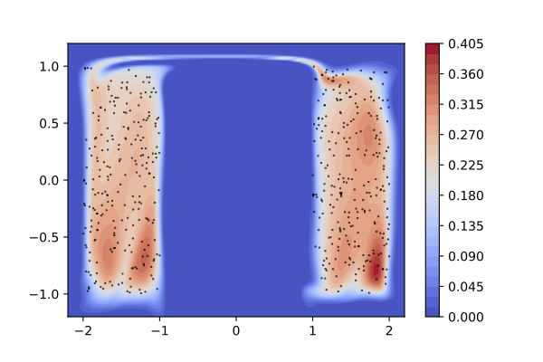
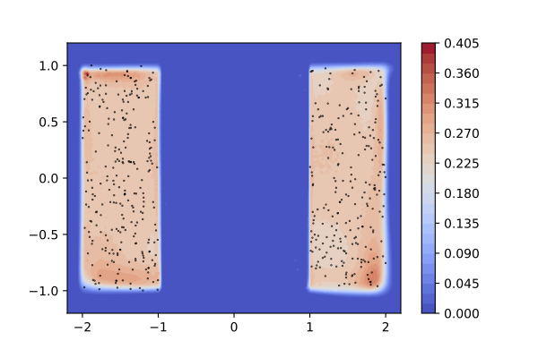
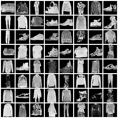
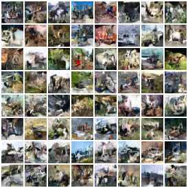
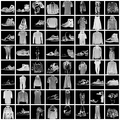
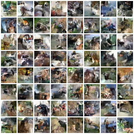

# README

Code release for [Localised Generative Flows](https://arxiv.org/abs/1909.13833) (LGFs).

## Usage

### Setup

First, install submodules:

    $ git submodule init
    $ git submodule update

Next, install dependencies. If you use `conda`, the following will create an environment called `lgf`:

    conda env create -f environment.yml

Activate this with

    conda activate lgf

before running any code or tests.

If you don't use `conda`, then please see `environment.yml` for a list of required packages, which will need to be installed manually via `pip` etc.

### Datasets

Our code runs on several types of datasets, including synthetic 2-D data, UCI data, and image data. For a full list run

    pipenv run ./main.py --help

The 2-D datasets are automatically generated, and the image datasets are downloaded automatically. However the UCI datasets will need to be manually downloaded from [this location](https://zenodo.org/record/1161203). The following should do the trick:

    mkdir -p DATA_ROOT && wget -O - https://zenodo.org/record/1161203/files/data.tar.gz | tar --strip-components=1 -C DATA_ROOT -xvzf - data/{gas,hepmass,miniboone,power}

Replace `DATA_ROOT` with the desired path to the data files. This path then needs to be specified as an argument to `main.py`.

### Training

To train our model on a simple 2D dataset, run:

    pipenv run ./main.py --dataset 2uniforms

By default, this will create a directory `runs/`, which will contain Tensorboard logs giving various information about the training run, including 2-D density plots in this case. To inspect this, ensure you have `tensorboard` installed (e.g. `pip install tensorboard`), and run in a new terminal:

    tensorboard --logdir runs/ --port=8008

Keep this running, and navigate to http://localhost:8008, where the results should be visible.

Each dataset has a default configuration set up for it that is described in the paper. For comparison purposes, for each model we also provide a standard baseline flow with roughly the same number of parameters. To run these, simply add the `--baseline` option when running `main.py`.

To inspect the model (either LGF or baseline) used for a given dataset, add the `--print-model` argument. To try out alternative configurations, simply modify the relevant options in `config.py`.

## Example results

### 2-D data

When trained on the `2uniforms` dataset, the baseline MAF will produce something like the following:

Notice that the MAF is unable to transform the support of the prior distribution (which is Gaussian) into the support of the target, which has two disconnected components and hence a different topology.

In contrast, LGF-MAF can properly separate the two components:

We also obtain improved performance when using LGFs on various UCI and image datasets. Although harder to visualise, we conjecture that an analogous story holds here as for the simple 2-D case.

### Generated images

Below are some samples generated by the models in this repository.

#### Baseline RealNVP

FashionMNIST

CIFAR10

#### LGF-RealNVP

FashionMNIST

CIFAR10

## Bibtex

    @misc{cornish2019localised,
        title={Localised Generative Flows},
        author={Rob Cornish and Anthony L. Caterini and George Deligiannidis and Arnaud Doucet},
        year={2019},
        eprint={1909.13833},
        archivePrefix={arXiv},
        primaryClass={stat.ML}
    }
